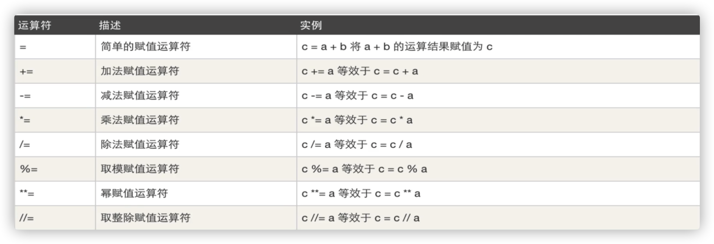
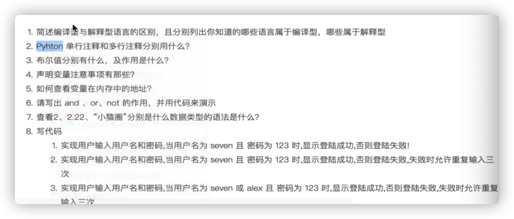

# 15.为啥要用列表

`[]`就是列表 在其他语言中 是数组

```python
>>> names = ["zs","ls","we","lw"]
>>> names[2]
'we'
```


# 16.列表的增删改查

## 增

### 插入

```python
>>> names.insert(4,"ylm")
>>> names
['zs', 'ls', 'we', 'lw', 'ylm']
>>> 
```

### 追加

把元素追加到列表最后面

```python
>>> names.append("xiaoqiang")
>>> names
['zs', 'ls', 'we', 'lw', 'ylm', 'xiaoqiang']
```

## 删

正向删除

```python
['zs', 'ls', 'we', 'lw', 'ylm', 'xiaoqiang']
>>> del names[5]
>>> names
['zs', 'ls', 'we', 'lw', 'ylm']
```

负向删除

```python
>>> names
['zs', 'ls', 'we', 'lw', 'ylm']
>>> del names[-1]
>>> names
['zs', 'ls', 'we', 'lw']
>>> 
```


**命令嵌套删除**

找到坐标 删除

```python
>>> del names[names.index('zs')]
>>> names
['ls', 'we', 'zs_gai']
```


## 改

```python
>>> names
['zs', 'ls', 'we', 'lw']
>>> names[-1] = "zs_gai"
>>> names
['zs', 'ls', 'we', 'zs_gai']
```

## 查

```python
>>> 'zs' in names
True
>>> 'zs2' in names
False
```


```python
>>> names.index("zs")
0
>>> names.index("zs2")
Traceback (most recent call last):
  File "<stdin>", line 1, in <module>
ValueError: 'zs2' is not in list
```


# 18.如何输出好看的文本

```python
>>> name = input("输入你的名字")
输入你的名字BlackGirl
>>> name
'BlackGirl'
>>> 
```

代码：

```python
name = input("输入你的名字")
age = input("输入你的年龄")
height = input("输入你的体重")
question = input("你是不是全身都黑:")

print(name)
print(age)
print(height)
print(question)

if question == "Y" or question == "y":
    print("我不信,让我看看。。。。")
```

Run:

```bash
name = input("输入你的名字")
age = input("输入你的年龄")
height = input("输入你的体重")
question = input("你是不是全身都黑:")

print(name)
print(age)
print(height)
print(question)

if question == "Y" or question == "y":
    print("我不信,让我看看。。。。")
```


**格式优化：**

代码

```bash
name = input("输入你的名字:")
age = input("输入你的年龄:")
height = input("输入你的体重:")
question = input("你是不是全身都黑:")

msg = '''
----------Personal Info-------
Name    : %s
Age     : %s
Height  : %s
Answer  : %s
----------End-------------
''' % (name,age,height,question)

print(msg)

if question == "Y" or question == "y":
    print("我不信,让我看看。。。。")
```

**run**

```bash
输入你的名字:ylm
输入你的年龄:22
输入你的体重:178
你是不是全身都黑:y

----------Personal Info-------
Name    : ylm
Age     : 22
Height  : 178
Answer  : y
----------End-------------

我不信,让我看看。。。。
```

# INT

如果我把%s 改成%d

```bash
Age     : %d
```

自此运行，会报语法错误

```bash
    msg = '''
TypeError: %d format: a number is required, not str
```

这是因为input默认接收的是字符串类型的；

解决：

```bash
age = int(input("输入你的年龄:"))
```

**完整版**

```bash
name = input("输入你的名字:")
age = int(input("输入你的年龄:"))
height = input("输入你的体重:")
question = input("你是不是全身都黑:")

#input 方法 接收到所有数据 都以字符串的格式处理
msg = '''
----------Personal Info-------
Name    : %s
Age     : %d
Height  : %s
Answer  : %s
----------End-------------
''' % (name,age,height,question)

print(msg)

if question == "Y" or question == "y":
    print("我不信,让我看看。。。。")
```


# Float

```bash
age = float(input("输入你的年龄:"))
```

打印出来是整数，并不是我们想要的小数

解决：

```bash
Age     : %f
```

完整版：

```bash
name = input("输入你的名字:")
age = float(input("输入你的年龄:"))
height = input("输入你的体重:")
question = input("你是不是全身都黑:")

#input 方法 接收到所有数据 都以字符串的格式处理
msg = '''
----------Personal Info-------
Name    : %s
Age     : %f
Height  : %s
Answer  : %s
----------End-------------
''' % (name,age,height,question)

print(msg)

if question == "Y" or question == "y":
    print("我不信,让我看看。。。。")
```

**输出结果**

```bash
输入你的名字:ylm
输入你的年龄:22.001
输入你的体重:178
你是不是全身都黑:y

----------Personal Info-------
Name    : ylm
Age     : 22.001000
Height  : 178
Answer  : y
----------End-------------

我不信,让我看看。。。。
```

# 20.运算符


## 算数运算

% 取模

```python
>>> 9%2
1    不能整除返回1
>>> 9%3
0    能整除返回0
>>> 
```

主要用来判断奇偶数

## 比较运算


```bash
1个 = 号是赋值  
>>> a =10
>>> b = 12
>>> a == b
False
```

## 赋值运算



```s
>>> a =10
>>> b = 12
>>> a == b
False
>>> a +=b
>>> a
22
```

## 逻辑运算

假设：a= 10 b=20


And

```bash
>>> a > 20 and b > 15 
False
```

and and 

```bash
>>> a > 20 and b > 10 and a > b
True
>>> 
```

or

```bash
>>> a > 20 or b > 100
True
```

no t

```bash
>>> a
22
>>> b
12
>>> not a > b
False
```

## 21.流程控制之if..else

if 条件

​	满足条件执行什么

## 单分支

if 条件

​	满足条件执行什么

```python
today_weather = "rain_day"
if today_weather == "rain_day":
    print("take your unbrella with you"
```

## 双分支

```python
if 条件：
		满足条件执行代码
else:
		if条件不满足就走这段
```


```python
age_of_ylm=22
if age_of_ylm == 22:
    print("too young,time to rewrite")
else:
    print("那你是几岁呢")
```

## 多分支

```python
if 条件:
  	满足条件执行代码
elif 条件:
		上面的条件不满足走这个
elif 条件:
		上面的条件不满足走这个
elif 条件:
		上面的条件不满足走这个
else 条件:
		上面的条件不满足走这个
```

**只能走一个条件**,满足之后 就退出；

```python
age = 18
if age < 10:
    print("上小学")
elif age > 13:
    print("上初中")
elif age >18:
    print("上大学")
else:
    print("大学毕业，该干嘛干嘛")
```

# 22.程序为什么要缩进

python选择了缩进代码的形式 来声明二级代码 ，来告诉程序要不要执行逻辑

**缩进原则：**

顶级代码顶行写，即如果一行代码不依赖于任何条件，那它必须不能进行任何缩进

同一级别的代码，缩进必须一致

官方建议缩进4个空格，当然你可以用两个，如果你想被人笑话的话

# 24.小练习-判断分数

```python
name = input("请输入你的名字")
fs = int(input("请输入你的分数:"))
msg = '''
-----------------
Name : %s
fs   : %d
---------------
''' % (name,fs)

if fs > 90 and fs < 100:
    print("A")
elif fs > 80 and fs < 89:
    print("B")
elif fs > 60 and fs < 79:
    print("C")
elif fs > 40 and fs < 59:
    print("please study hard")
else:
    print("叫家长")
```

# 25.猜随机数小程序开发

提供随机数

```python
import random  #调用工具包
print(random.randint(0,10))
```


```python
import random
n = random.randint(0,10)

user_guess = int(input("Input your guess"))
msg = '''
user_guess: %d
''' % (user_guess)
if user_guess > n:
    print("too big")
elif user_guess < n:
    print("too small")
elif user_guess == n:
    print("configuration to you,you are great")
else:
    print("继续努力吧")
```


```python
import random
n = random.randint(0,10)

money = float(input("请投币:"))
user_guess = int(input("Input your guess:"))
msg = '''
user_guess: %d
money     : %f
''' % (user_guess,money)
if money == 1:
    if user_guess > n:
        print("too big")
    elif user_guess < n:
        print("too small")
    elif user_guess == n:
        print("获得特等奖")
    else:
        print("继续努力吧")
elif money < 1:
    print("金额不足")
    exit(0)
```

# 26. while循环

语法:

```bash
while 条件:
		执行代码
```

 

```python
count = 0
while count < 100:
    print("I love you",count)
    count +=1
```

# 27. 打印0到100之间所有的偶数

```bash
count = 0
while count < 100:
    if count % 2 == 0:
        print("I love you", count)
    count +=1
```

奇数

```bash
count = 1
while count < 100:
    if count % 2 == 1:
        print("I love you", count)
    count +=1
```


```bash
import random
n = random.randint(0,10)


#money = float(input("请投币:"))


count = 0
while count < 5:
    user_guess = int(input("Input your guess:"))
    msg = '''
    user_guess: %d
    ''' % (user_guess)
    if user_guess > n:
        print("too big")
    elif user_guess < n:
        print("too small")
    elif user_guess == n:
        print("bingo you got it")
    else:
        print("please hard work")
    count +=1

print(n)
```

# 28.break continue语法

break continue只有在循环中使用

break 中止循环

continue 中止本次循环

exit() 直接退出程序

## 匹配到之后 直接退出程序

```bash
import random
n = random.randint(0,10)


#money = float(input("请投币:"))


count = 0
while count < 5:
    user_guess = int(input("Input your guess:"))
    msg = '''
    user_guess: %d
    ''' % (user_guess)
    if user_guess > n:
        print("too big")
    elif user_guess < n:
        print("too small")
    elif user_guess == n:
        print("bingo you got it")
        exit()   
    else:
        print("please hard work")
    count +=1

print(n)
```

Break:匹配到之后直接退出循环

```bash
import random
n = random.randint(0,10)


#money = float(input("请投币:"))


count = 0
while count < 5:
    user_guess = int(input("Input your guess:"))
    msg = '''
    user_guess: %d
    ''' % (user_guess)
    if user_guess > n:
        print("too big")
    elif user_guess < n:
        print("too small")
    elif user_guess == n:
        print("bingo you got it")
        break
    else:
        print("please hard work")
    count +=1

print(n) #匹配到之后会 打印
```

## Continue:中止当次循环

大于10和小于 20 不打印

```bash
count = 0
while count < 100:
    count +=1
    if count > 10 and count < 20:
        continue
    print(count)
```


正常结束：没有被break 掉

```bash
count = 0
while count < 100:
    count +=1
    if count > 10 and count < 20:
        continue
    print(count)
else:  #当循环正常结束后执行
    print("sdsdsd")
```

Run:

```
1
.....
99
100
sdsdsd
```

增加break参数：

```bash
count = 0
while count < 100:
    count +=1
    if count == 50:
        break
    print(count)
else:  #当循环正常结束后执行
    print("sdsdsd")
```

走到50 后退出了 else里额参数是不会执行的

被break中止时 不执行

Run:

```bash
47
48
49
```

# 29.死循环-dead loop

想让他一直执行 ，就要让条件一直为真

```python
while True:
    print("你是风儿我是沙,缠缠绵绵到天涯")
```

# 30.小练习


```python
import random
n = random.randint(0,100)
count = 0
while count < 3:
    guess = int(input("please you guess:"))
    msg = '''
    guess  : %d
    ''' % (guess)
    if guess == n:
        print("bingo,you got it")
        break
    else:
        print("no")
    count +=1
print(n)
```


```python
import random
n = random.randint(1,100)
n1 = random.randint(1,100)
count = 0
while True:
    while count < 3:
        guess = input("please you guess:")
        msg = '''
        guess  :  %s
        ''' % (guess)
        if guess == n:
            print("you git it")
            break
        else:
            print("不对")
        count += 1
    print(n)
    jx = input("请问是否继续:")
    msg = '''
            jx : %s
            ''' % (jx)
    if jx == "y" or jx == "Y":
        print("yes")
        count1 = 0
        while count1 < 3:
            guess = input("please you guess:")
            msg = '''
            guess  :  %s
            ''' % (guess)
            if guess == n1:
                print("you git it")
                break
            else:
                print("不对")
            count1 += 1
        print(n1)
    elif jx == "no" or jx == "NO":
        exit()
    else:
        print("无法识别 请重新输入")
```




## 1.

编译型：c语言 go语言

解释型 ：python 可以调用模块

## 2.

单行注释 用 # 多行用 “”“  ””“

## 3.

true false 作用进行判断

## 4.

声明变量 

程序是自上而下的 ，必须先声明 后调用


法律上： 字母数字下划线的组合

变量第一个字母不能是数字


道德上

驼峰体

下划线

！ -  #:这些特殊字符不能当作变量使用

变量名不要过长

常量 用大写字母定义

## 5.

使用id

## 6.

他们都是逻辑运算符

and  ：判断条件为真的时候

not 取反

 or： 又一个为真 则为真 

## 7.type

```python
n = 2
print(type(n))

n = 2.22
print(type(n))

n = "小圆圈"
print(type(n))
```

## 8.

### 1

```python
user = "seven"
passwd = "123"
username = input("请输入用户名:")
password = input("请输入密码:")
msg = '''
username : %s
password : %s
'''
if username == user and password == passwd:
    print("login successed")
else:
    print("lgin failure")
```

### 2.

```python
user = "seven"
passwd = "123"
count = 0
while count <3:
    username = input("请输入用户名:")
    password = input("请输入密码:")
    msg = '''
    username : %s
    password : %s
    '''
    if username == user and password == passwd:
        print("login successed")
    else:
        print("lgin failure")
    count +=1
```

### 3.

```python
user = "seven"
passwd = "123"
count = 0
while count <3:
    username = input("请输入用户名:")
    password = input("请输入密码:")
    msg = '''
    username : %s
    password : %s
    '''
    if username == "seven" or username == "alex" and password == "123":
        print("login successed")
        break
    else:
        print("lgin failure")
    count +=1
```


## 9.

```python
count_red = 0
red_list = []
blue_list = []
while count_red < 6:
    r = int(input("select red ball:"))
    if r > 0 and r < 32:
        red_list.append(r)
    elif 'r' in red_list:
        print("already exist")
        continue
    else:
        print("between 1-32")
        continue
    count_red +=1
count_blue = 0
while count_blue < 2:
    b = int(input("select blue ball:"))
    blue_list.append(b)
    count_blue +=1
print("red ball:" ,red_list)
print("blue ball:" ,blue_list)
```

